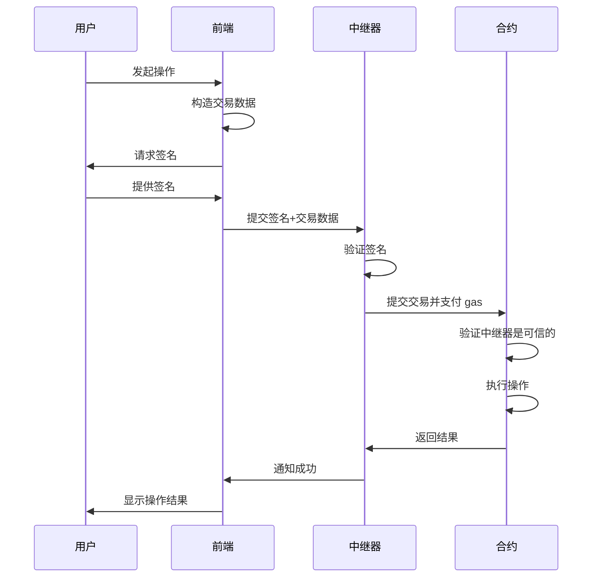

# Synthetixio/420 项目用户流程和交互分析报告

## 1. 概述

本报告分析 Synthetixio/420 项目的用户交互流程、界面设计和用户体验。420 项目为用户提供了管理 Synthetix V3 协议中 SNX 质押的简化接口，理解用户如何与这些合约交互对于评估项目的可用性和采用潜力至关重要。本报告将详细说明主要用户流程、交互复杂性、潜在的用户体验问题，并提供改进建议。

## 2. 主要用户角色和场景

### 2.1 用户角色

420 项目主要面向以下用户角色：

1. **SNX 持有者** - 希望在 Synthetix V3 协议中质押 SNX 并参与 420 池的用户
2. **现有 Synthetix V2 用户** - 希望迁移到 V3 生态系统的用户
3. **流动性提供者** - 临时参与和退出流动性池的用户
4. **前端开发者** - 构建与 420 合约交互的 dApp 的开发者

### 2.2 主要用户场景

用户与 420 项目的主要交互场景包括：

1. **位置设置** - 创建新质押位置并委托给 420 池
2. **位置迁移** - 将位置从其他池迁移到 420 池
3. **位置查询** - 查看当前位置的抵押品和贷款信息
4. **提取抵押品** - 从现有位置提取部分或全部抵押品
5. **关闭位置** - 完全退出 420 池并收回所有抵押品

## 3. 核心用户流程分析

### 3.1 位置设置流程

**对应合约**: `PositionManager420.setupPosition()`


**用户步骤**:
1. 用户需要授权 PositionManager420 合约使用其 SNX 代币
2. 用户调用 `setupPosition` 函数，指定要质押的 SNX 数量
3. 合约检查用户是否有现有账户，如果没有则创建一个新账户
4. 合约存入 SNX，将其委托给 420 池，并启用 staking
5. 用户获得账户 ID，代表其在 420 池中的位置

**交互复杂性**:
- 需要两个交易（授权 + 设置位置）
- 用户必须指定精确的 SNX 数量
- 交易失败可能发生在多个步骤，需要清晰的错误处理

### 3.2 位置迁移流程

**对应合约**: `PositionManager420.migratePosition()`


**用户步骤**:
1. 用户调用 `migratePosition` 函数，指定要迁移的账户 ID
2. 合约临时转移用户的账户 NFT 以获取控制权
3. 合约检查并处理现有贷款（如有）
4. 合约将委托从现有池迁移到 420 池
5. 合约启用 staking 并返还账户 NFT
6. 用户现在在 420 池中有了活跃位置

**交互复杂性**:
- 单一交易，但内部执行多个复杂步骤
- 可能需要额外的 snxUSD 来处理贷款
- 需要用户了解迁移对其贷款和奖励的影响

### 3.3 位置查询流程

**对应合约**: `Pool420` 查询函数


**用户步骤**:
1. 用户调用 `getAccounts` 获取其拥有的账户列表
2. 用户调用 `getTotalDeposit` 和 `getTotalLoan` 查看总存款和贷款
3. 前端界面展示用户位置的完整状态

**交互复杂性**:
- 纯查询操作，无需发送交易
- 多次 RPC 调用以获取完整信息
- 处理多个账户需要聚合数据

### 3.4 提取抵押品流程

**对应合约**: `Pool420Withdraw.withdrawCollateral()`


**用户步骤**:
1. 用户调用 `withdrawCollateral` 函数，指定账户 ID 和抵押品类型
2. 合约临时转移用户的账户 NFT 以获取控制权
3. 合约撤销委托，提取抵押品，并将代币转给用户
4. 合约返还账户 NFT
5. 用户收到提取的抵押品代币

**交互复杂性**:
- 单一交易，但可能受到委托状态限制
- 用户需要选择正确的抵押品类型
- 无法指定提取金额，总是提取全部可用抵押品

### 3.5 关闭位置流程

**对应合约**: `Pool420Withdraw.closePosition()` 或 `PositionManager420.closePosition()`


**用户步骤**:
1. 用户选择使用 `PositionManager420` 或 `Pool420Withdraw` 关闭位置
   - `PositionManager420` 强制最小委托时间
   - `Pool420Withdraw` 允许立即关闭
2. 用户调用 `closePosition` 函数，指定账户 ID
3. 合约临时转移 NFT，偿还任何贷款，取消 staking，提取所有抵押品
4. 合约返还 NFT
5. 用户收到所有抵押品，位置完全关闭

**交互复杂性**:
- 需要足够的 snxUSD 或 sUSD 偿还贷款
- 用户需要在两个具有不同行为的合约之间选择
- 理解时间锁定的影响和绕过选项

## 4. 状态转换图

以下状态转换图展示了用户位置从创建到关闭的完整生命周期：


此图展示了用户位置可能经历的各种状态，以及触发状态转换的操作。注意，一些状态转换可能需要与 420 项目之外的 Synthetix 合约交互。

## 5. 元交易支持分析

### 5.1 元交易机制

420 项目通过继承 OpenZeppelin 的 `ERC2771Context` 实现了元交易支持：

```solidity
// 在构造函数中设置可信转发器
constructor(..., address trustedForwarder_) ERC2771Context(trustedForwarder_) {
    // ...
}

// 在函数中使用 _msgSender() 而非 msg.sender
address msgSender = _msgSender();
```

这允许用户通过中继器提交交易，而无需直接支付 gas 费用。

### 5.2 元交易对用户体验的影响

**优势**:
- 新用户无需持有 ETH 即可与协议交互
- 降低进入门槛，特别是对加密新手
- 允许应用程序补贴 gas 费用，提升采用率
- 在 gas 价格高时提供更好的用户体验

**局限性**:
- 依赖特定的可信转发器
- 可能增加交易的复杂性和延迟
- 需要特殊的前端集成
- 中继器可能有使用限制或费用

### 5.3 元交易用户流程



这种流程使用户无需直接提交交易或支付 gas，从而简化了用户体验。

## 6. 用户交互复杂性评估

### 6.1 复杂性评分

以下是各主要用户流程的复杂性评分（1-10，10 最复杂）：

| 用户流程 | 复杂性评分 | 主要复杂因素 |
|----------|------------|-------------|
| 位置设置 | 6 | 需要授权和精确的 SNX 数量 |
| 位置迁移 | 8 | 迁移逻辑复杂，可能需要额外代币 |
| 位置查询 | 3 | 多个 RPC 调用和数据聚合 |
| 提取抵押品 | 5 | 目前不支持部分提取 |
| 关闭位置 | 7 | 需要选择合约并可能需要额外代币 |

### 6.2 用户认知负担

1. **概念复杂性**：
   - 用户需要理解 NFT 账户、抵押品委托和 staking 概念
   - 需要区分 sUSD 和 snxUSD
   - 需要理解时间锁定和为何存在两种关闭位置的方式

2. **决策点**：
   - 设置位置时决定质押多少 SNX
   - 迁移时决定是否有足够的 snxUSD 来处理贷款
   - 关闭位置时选择立即退出或遵守时间锁定

3. **错误处理**：
   - 交易可能在多个点失败，用户需要理解错误原因
   - 如果贷款验证失败，用户需要知道获取更多 snxUSD 的途径

## 7. 用户界面需求

### 7.1 前端关键组件

为支持完整的用户体验，前端应用应包含以下关键组件：

1. **帐户概览**：
   - 显示用户拥有的所有账户
   - 每个账户的存款、贷款和奖励信息
   - 委托状态和时间锁定剩余时间

2. **操作面板**：
   - 设置新位置表单
   - 迁移位置选项
   - 提取和关闭功能
   - 气体估算和成本预览

3. **资产管理器**：
   - SNX、sUSD 和 snxUSD 余额
   - 授权状态和管理
   - 代币获取选项（如兑换功能）

4. **通知系统**：
   - 交易状态和确认
   - 错误解释和建议操作
   - 时间锁定到期提醒

### 7.2 交互设计建议

1. **简化位置设置**：
   - 提供最大余额按钮和百分比选择器
   - 自动处理授权步骤
   - 显示预期奖励和收益预测

2. **智能迁移辅助**：
   - 自动检测和显示可迁移的位置
   - 预先估算所需的 snxUSD 数量
   - 提供一键迁移选项

3. **增强型位置管理**：
   - 可视化显示位置状态和锁定倒计时
   - 合并查询调用以减少加载时间
   - 提供操作历史和分析

4. **关闭位置引导**：
   - 明确解释两种关闭选项的区别
   - 如果时间锁定尚未满足，显示剩余时间
   - 帮助用户确保有足够的代币偿还贷款

## 8. 用户体验挑战和解决方案

### 8.1 已识别的用户体验挑战

1. **临时 NFT 转移的不透明性**：
   - 用户难以理解 NFT 临时转移的概念
   - 可能担心授权合约控制其 NFT

2. **双合约选择的混淆**：
   - 用户可能不理解为何有两个合约处理关闭位置
   - 可能在不了解区别的情况下选择错误的合约

3. **全部提取限制**：
   - 当前实现只允许提取全部抵押品，无法部分提取
   - 限制了用户的灵活性

4. **气体成本和交易失败**：
   - 复杂操作导致较高的气体成本
   - 多步骤操作增加了交易失败的可能性

### 8.2 建议解决方案

1. **改进临时 NFT 转移体验**：
   - 在前端清晰说明 NFT 转移过程
   - 添加交易追踪，显示 NFT 位置和状态
   - 考虑实现批处理功能，减少 NFT 转移次数

2. **统一合约界面**：
   - 创建统一的前端接口，隐藏底层合约选择
   - 基于用户意图和时间锁定状态自动选择合约
   - 提供明确的交易后果说明

3. **实现部分提取功能**：
   - 增强合约以支持指定提取金额
   - 允许用户保留部分抵押品继续获得奖励
   - 添加流动性管理建议

4. **优化气体使用和错误处理**：
   - 实现批量操作以减少总体气体成本
   - 提供详细的错误解释和修复建议
   - 添加交易模拟以预测并避免失败

## 9. 前端集成指南

### 9.1 推荐技术栈

为与 420 项目合约交互构建前端应用，我们推荐以下技术栈：

- **Web3 连接**: ethers.js 或 web3.js
- **UI 框架**: React 或 Vue.js
- **元交易支持**: Biconomy 或 OpenGSN
- **状态管理**: Redux 或 MobX
- **数据获取**: React Query 或 SWR

### 9.2 关键集成点

1. **合约初始化**：

```javascript
// 示例使用 ethers.js
const initContracts = async (provider, signer) => {
  const pool420 = new ethers.Contract(
    POOL420_ADDRESS,
    POOL420_ABI,
    provider
  );
  
  const positionManager = new ethers.Contract(
    POSITION_MANAGER_ADDRESS,
    POSITION_MANAGER_ABI,
    signer
  );
  
  const poolWithdraw = new ethers.Contract(
    POOL_WITHDRAW_ADDRESS,
    POOL_WITHDRAW_ABI,
    signer
  );
  
  return { pool420, positionManager, poolWithdraw };
};
```

2. **位置设置流程**：

```javascript
const setupPosition = async (amount) => {
  try {
    // 检查授权
    const snxContract = new ethers.Contract(SNX_ADDRESS, ERC20_ABI, signer);
    const allowance = await snxContract.allowance(userAddress, POSITION_MANAGER_ADDRESS);
    
    if (allowance.lt(amount)) {
      // 请求授权
      const approveTx = await snxContract.approve(POSITION_MANAGER_ADDRESS, ethers.constants.MaxUint256);
      await approveTx.wait();
    }
    
    // 设置位置
    const tx = await positionManager.setupPosition(amount);
    const receipt = await tx.wait();
    
    // 解析事件找到账户 ID
    const event = receipt.events.find(e => e.event === "PositionCreated");
    return event.args.accountId;
  } catch (error) {
    console.error("Setup position failed:", error);
    throw error;
  }
};
```

3. **元交易集成**：

```javascript
// 使用 Biconomy 示例
const setupMetaTransaction = async () => {
  const biconomy = new Biconomy(provider, {
    apiKey: BICONOMY_API_KEY,
    debug: true
  });
  
  const biconomyProvider = await biconomy.provider;
  
  // 使用 biconomyProvider 创建合约实例
  const metaTxPositionManager = new ethers.Contract(
    POSITION_MANAGER_ADDRESS,
    POSITION_MANAGER_ABI,
    biconomyProvider
  );
  
  return metaTxPositionManager;
};

// 使用元交易发送交易
const setupPositionWithMeta = async (amount) => {
  try {
    const metaTxPositionManager = await setupMetaTransaction();
    const tx = await metaTxPositionManager.setupPosition(amount);
    const receipt = await tx.wait();
    return receipt;
  } catch (error) {
    console.error("Meta-tx failed:", error);
    throw error;
  }
};
```

### 9.3 用户数据获取和聚合

```javascript
const getUserPositionData = async (userAddress) => {
  try {
    // 获取用户账户
    const accountIds = await pool420.getAccounts();
    
    // 并行获取每个账户的数据
    const positionPromises = accountIds.map(async (accountId) => {
      const deposit = await pool420.getPositionCollateral(accountId);
      const loan = await pool420.getPositionDebt(accountId);
      const rewards = await pool420.rewardsEarned(accountId);
      
      return {
        accountId,
        deposit,
        loan,
        rewards,
        // 计算健康因子等附加信息
        healthFactor: calculateHealthFactor(deposit, loan)
      };
    });
    
    const positions = await Promise.all(positionPromises);
    
    // 聚合总数据
    const totalDeposit = positions.reduce((sum, pos) => sum.add(pos.deposit), ethers.BigNumber.from(0));
    const totalLoan = positions.reduce((sum, pos) => sum.add(pos.loan), ethers.BigNumber.from(0));
    const totalRewards = positions.reduce((sum, pos) => sum.add(pos.rewards), ethers.BigNumber.from(0));
    
    return {
      positions,
      totalDeposit,
      totalLoan,
      totalRewards
    };
  } catch (error) {
    console.error("Failed to fetch position data:", error);
    throw error;
  }
};
```

## 10. 用户流程改进建议

### 10.1 短期改进（合约层面）

1. **实现部分提取功能**：
   ```solidity
   function withdrawPartialCollateral(
       uint128 accountId,
       address collateralType,
       uint256 amount
   ) public {
       // 实现部分提取逻辑
   }
   ```

2. **添加批量操作支持**：
   ```solidity
   function batchWithdraw(
       uint128[] calldata accountIds,
       address[] calldata collateralTypes
   ) public {
       // 实现批量提取逻辑
   }
   ```

3. **统一关闭位置界面**：
   ```solidity
   function closePositionWithOptions(
       uint128 accountId,
       bool bypassTimelock,
       bool useV2Token
   ) public {
       // 基于选项选择适当的逻辑路径
   }
   ```

### 10.2 中期改进（协议层面）

1. **实现位置合并功能**：
   允许用户将多个位置合并为一个，简化管理并优化 gas 使用

2. **添加金库自动化**：
   实现自动化策略，如自动复投奖励或基于健康因子的调整

3. **改进元交易架构**：
   实现更高效的元交易处理，包括批量元交易和优化的 gas 处理

### 10.3 长期改进（生态系统层面）

1. **多链支持**：
   将 420 项目扩展到多个链，支持跨链位置管理

2. **集成挖矿流动性激励**：
   实现额外的激励机制，鼓励用户参与 420 池

3. **DAO 治理整合**：
   允许社区参与决策，如调整参数、升级合约等

## 11. 总结与建议

Synthetixio/420 项目提供了管理 Synthetix V3 协议中 SNX 质押的用户友好接口。通过分析用户流程和交互模式，我们发现该项目有几个关键优势和改进机会：

### 11.1 主要优势

1. **简化的质押体验**：
   - 用户可以通过简单的接口设置、管理和关闭位置
   - 抽象了 Synthetix V3 的复杂性，降低了进入门槛

2. **灵活的位置管理**：
   - 支持位置迁移和提取
   - 提供无时间锁选项用于紧急情况

3. **元交易支持**：
   - 降低了新用户的 gas 成本障碍
   - 提升了整体用户体验

### 11.2 主要改进机会

1. **简化用户界面**：
   - 统一合约接口，隐藏底层复杂性
   - 提供更直观的位置生命周期管理

2. **增强功能灵活性**：
   - 实现部分提取功能
   - 添加批量操作支持
   - 简化贷款管理流程

3. **优化用户体验**：
   - 提供更好的错误处理和恢复机制
   - 改进数据聚合和状态可视化
   - 增强元交易支持

### 11.3 最终建议

1. **投资前端开发**：
   创建一个直观、响应式的前端，抽象底层合约复杂性

2. **优先实现关键增强功能**：
   部分提取、批量操作和统一界面是最高优先级

3. **加强用户教育**：
   提供清晰的文档、教程和引导式界面

4. **监听社区反馈**：
   建立反馈渠道，持续改进用户体验

通过实施这些建议，420 项目可以显著提升用户体验，降低进入门槛，并增强对 Synthetix 生态系统的采用，同时保持其作为 SNX 质押简化接口的核心价值主张。 