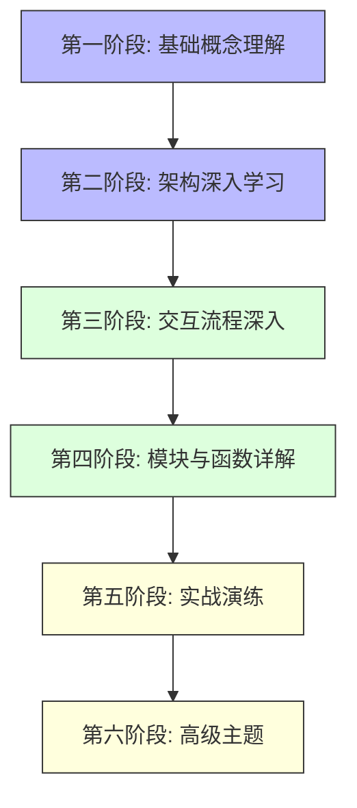
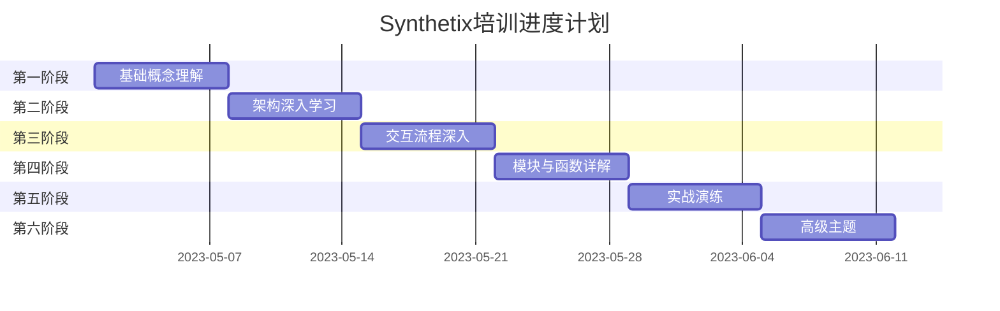

# Synthetix V3 & 420 Pool 开发者培训计划

## 任务使命 (Mission)

通过系统化培训，使开发者全面理解Synthetix V3生态系统和420 Pool的架构、交互模式和开发流程，能够独立进行相关功能的开发、调试和优化工作。

## 背景上下文 (Context)

Synthetix V3是一个强大的去中心化金融协议，提供合成资产铸造和交易功能。420 Pool是基于Synthetix V3构建的特定质押池产品，需要深入理解其架构设计和接口调用才能有效开展开发工作。

本培训计划针对新加入的开发者，从基础概念入门，逐步深入到核心模块和复杂交互，最终达到能够独立开发和优化系统的水平。培训内容涵盖合约架构、前端实现、交互流程和最佳实践等多个方面。

## 执行计划 (Plan)

培训将分为六个主要阶段，每个阶段聚焦特定领域，由浅入深，循序渐进：

### 培训文档列表

1. **基础概念文档**
   - [01-Synthetix生态概览.md](./01-Synthetix生态概览.md) - Synthetix V3生态系统介绍
   - [02-420Pool项目定位.md](./02-420Pool项目定位.md) - 420 Pool的目标和功能
   - [03-技术栈概览.md](./03-技术栈概览.md) - 相关技术栈介绍

2. **架构文档**
   - [04-合约架构分析.md](./04-合约架构分析.md) - 核心合约结构和关系
   - [05-核心接口学习.md](./05-核心接口学习.md) - Synthetix V3关键接口详解
   - [06-数据流分析.md](./06-数据流分析.md) - 系统数据流向和状态变化

3. **交互流程文档**
   - [07-质押流程详解.md](./07-质押流程详解.md) - 用户质押资产完整流程
   - [08-提款流程详解.md](./08-提款流程详解.md) - 用户提取资产完整流程
   - [09-奖励领取流程.md](./09-奖励领取流程.md) - 奖励计算和领取流程

4. **模块详解文档**
   - [10-NFT账户模型.md](./10-NFT账户模型.md) - NFT账户机制详解
   - [11-质押池管理.md](./11-质押池管理.md) - 质押池配置与管理
   - [12-前端实现指南.md](./12-前端实现指南.md) - 前端与合约交互实现

5. **实战文档**
   - [13-环境搭建指南.md](./13-环境搭建指南.md) - 开发环境配置步骤
   - [14-合约交互示例.md](./14-合约交互示例.md) - 常见操作代码示例
   - [15-调试技巧指南.md](./15-调试技巧指南.md) - 问题诊断和调试方法

6. **高级主题文档**
   - [16-性能优化指南.md](./16-性能优化指南.md) - Gas优化和性能提升
   - [17-安全最佳实践.md](./17-安全最佳实践.md) - 合约安全和风险控制
   - [18-系统集成指南.md](./18-系统集成指南.md) - 与其他系统集成方案

### 学习路径建议

```mermaid
flowchart TD
    subgraph "第一周"
        A1[Synthetix生态概览] --> A2[420Pool项目定位]
        A2 --> A3[技术栈概览]
    end
    
    subgraph "第二周"
        B1[合约架构分析] --> B2[核心接口学习]
        B2 --> B3[数据流分析]
    end
    
    subgraph "第三周"
        C1[质押流程详解] --> C2[提款流程详解]
        C2 --> C3[奖励领取流程]
    end
    
    subgraph "第四周"
        D1[NFT账户模型] --> D2[质押池管理]
        D2 --> D3[前端实现指南]
    end
    
    subgraph "第五周"
        E1[环境搭建指南] --> E2[合约交互示例]
        E2 --> E3[调试技巧指南]
    end
    
    subgraph "第六周"
        F1[性能优化指南] --> F2[安全最佳实践]
        F2 --> F3[系统集成指南]
    end
    
    A3 --> B1
    B3 --> C1
    C3 --> D1
    D3 --> E1
    E3 --> F1
    
    style A1 fill:#bbf,stroke:#333
    style A2 fill:#bbf,stroke:#333
    style A3 fill:#bbf,stroke:#333
    style B1 fill:#bbf,stroke:#333
    style B2 fill:#bbf,stroke:#333
    style B3 fill:#bbf,stroke:#333
    style C1 fill:#dfd,stroke:#333
    style C2 fill:#dfd,stroke:#333
    style C3 fill:#dfd,stroke:#333
    style D1 fill:#dfd,stroke:#333
    style D2 fill:#dfd,stroke:#333
    style D3 fill:#dfd,stroke:#333
    style E1 fill:#ffd,stroke:#333
    style E2 fill:#ffd,stroke:#333
    style E3 fill:#ffd,stroke:#333
    style F1 fill:#ffd,stroke:#333
    style F2 fill:#ffd,stroke:#333
    style F3 fill:#ffd,stroke:#333
```

### 培训资源

本培训计划使用的主要资源来自以下仓库：

1. [Synthetix V3](https://github.com/Synthetixio/synthetix-v3) - Synthetix V3核心合约和文档
2. [Synthetix Vaults](https://github.com/Synthetixio/synthetix-vaults) - Synthetix金库实现
3. [Synthetix Gitbook V3](https://github.com/Synthetixio/Synthetix-Gitbook-v3) - Synthetix V3官方文档

这些仓库的主要内容已下载到`/Users/gz/Desktop/synthetix-training/resources`目录中，供培训过程参考。

### 评估方式

每个阶段结束后，将通过以下方式评估学习效果：

1. **概念理解测验** - 检验对关键概念的掌握程度
2. **代码实现作业** - 完成特定功能的代码实现
3. **系统设计讨论** - 参与系统设计和架构讨论
4. **问题排查演示** - 诊断和解决预设的系统问题
5. **文档贡献** - 对现有文档进行补充和改进

### 进度追踪

## 预期成果

完成本培训计划后，开发者将能够：

1. 全面理解Synthetix V3和420 Pool的架构设计和工作原理
2. 熟练掌握核心接口的调用方法和参数要求
3. 独立实现和调试与Synthetix V3交互的功能
4. 优化合约调用以提升性能和降低Gas消耗
5. 遵循最佳实践进行安全开发和系统集成

## 后续发展

培训完成后，开发者可以选择以下方向继续深化：

1. **协议开发** - 参与Synthetix V3协议改进和新功能开发
2. **应用开发** - 基于Synthetix V3构建新的DeFi应用
3. **工具开发** - 开发提升开发效率和用户体验的工具
4. **文档贡献** - 完善和扩展项目文档

## 维护与更新

本培训计划将根据Synthetix V3的发展和420 Pool的需求定期更新，确保内容的准确性和实用性。

最后更新时间：`2023-05-22` 