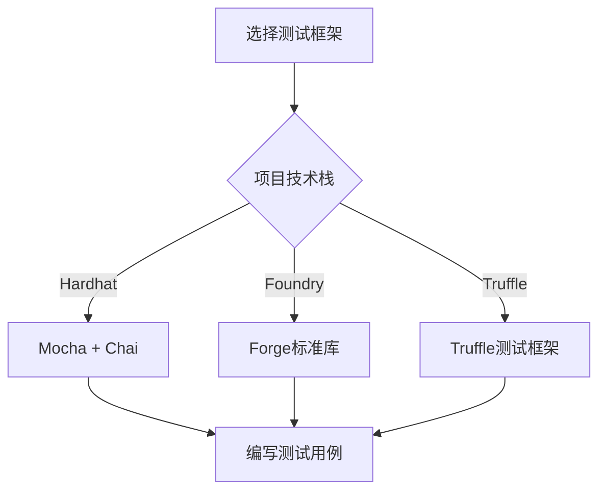
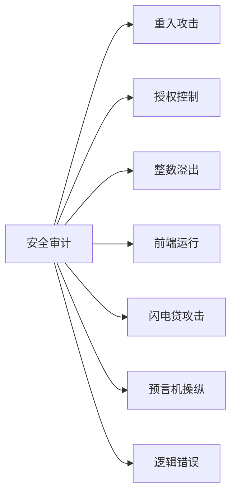

# Synthetix V3 & 420 Pool 测试策略与实践

## 任务使命 (Mission)

掌握Synthetix V3和420 Pool项目的测试策略与最佳实践，确保系统的安全性、可靠性和符合预期的功能表现。

## 背景上下文 (Context)

智能合约一旦部署到区块链上就很难修改，因此全面的测试至关重要。Synthetix V3和420 Pool作为复杂的DeFi系统，需要严格的测试策略来保证资金安全和系统稳定性。本文档将介绍适用于这类项目的测试方法、工具和实践经验。

## 执行计划 (Plan)

本文档将系统介绍以下测试相关内容：

1. 测试分层策略
2. 单元测试实践
3. 集成测试方法
4. 模糊测试技术
5. 形式化验证
6. 安全审计实践
7. 测试环境搭建

## 1. 测试分层策略

### 1.1 测试金字塔模型

```mermaid
pyramid
    title Synthetix测试策略金字塔
    section 安全审计
        形式化验证: 1
        安全审计: 2
    section 集成测试
        系统集成测试: 3
        合约交互测试: 4
    section 单元测试
        模糊测试: 5
        函数单元测试: 6
        属性测试: 7
```

DeFi项目的测试应该采用分层策略，从底层的单元测试到顶层的安全审计，形成完整的测试覆盖：

1. **单元测试**：验证合约中各个函数的独立行为
2. **集成测试**：验证合约间交互和复杂功能流程
3. **系统测试**：验证整个系统在各种场景下的行为
4. **安全审计**：专注于安全漏洞和攻击向量的识别

### 1.2 测试覆盖范围

420 Pool项目的关键测试覆盖范围：

| 功能模块 | 测试重点 | 优先级 |
|---------|---------|-------|
| 临时授权机制 | 正确授权与撤销、边界情况 | 高 |
| 债务减免算法 | 计算准确性、边界值、时间相关行为 | 高 |
| 质押与提款 | 状态转换、资金流向、错误处理 | 高 |
| 奖励计算 | 计算准确性、累积器更新、边界情况 | 中 |
| 安全控制 | 暂停机制、权限控制、限额检查 | 高 |
| Gas优化 | 关键操作的Gas消耗 | 中 |

## 2. 单元测试实践

### 2.1 单元测试框架选择



推荐的测试框架：

1. **Hardhat + Mocha/Chai**：灵活性高，适合TypeScript开发环境
2. **Foundry/Forge**：高效的Solidity原生测试框架，适合纯Solidity开发者
3. **Truffle**：成熟稳定的测试环境，适合与其他Truffle工具链配合

### 2.2 单元测试案例示例

以债务减免算法为例的单元测试：

```solidity
// 使用Forge测试框架
function testDebtReliefCalculation() public {
    // 设置初始状态
    uint256 originalDebt = 1000 ether;
    uint256 jubileePeriod = 365 days;
    
    // 模拟用户质押
    address user = address(0x1);
    _mockStake(user, 100 ether, originalDebt, block.timestamp);
    
    // 测试时间推移一半期限的情况
    vm.warp(block.timestamp + jubileePeriod / 2);
    uint256 relief = pool420.calculateDebtRelief(user);
    assertApproxEqRel(relief, originalDebt / 2, 0.01e18); // 允许1%误差
    
    // 测试时间推移超过期限的情况
    vm.warp(block.timestamp + jubileePeriod);
    relief = pool420.calculateDebtRelief(user);
    assertEq(relief, originalDebt); // 应完全减免
}
```

### 2.3 状态属性测试

验证合约关键状态属性的测试：

```solidity
// 测试质押后的状态一致性
function testStakeStateConsistency() public {
    uint256 stakeAmount = 100 ether;
    
    // 执行质押
    vm.startPrank(alice);
    snxToken.approve(address(pool420), stakeAmount);
    pool420.stake(stakeAmount);
    vm.stopPrank();
    
    // 验证状态一致性
    (uint256 userStaked, uint256 originalDebt, uint256 currentDebt, uint256 entryTime) = 
        pool420.getPosition(alice);
    
    assertEq(userStaked, stakeAmount);
    assertTrue(originalDebt > 0);
    assertEq(currentDebt, originalDebt);
    assertEq(entryTime, block.timestamp);
    
    // 验证全局状态
    assertEq(pool420.totalStaked(), stakeAmount);
}
```

## 3. 集成测试方法

### 3.1 合约交互测试

测试多个合约间交互的完整性：

```solidity
// 测试质押-减免-提款完整流程
function testStakeReliefWithdrawFlow() public {
    // 准备
    uint256 stakeAmount = 100 ether;
    uint256 jubileePeriod = pool420.jubileePeriod();
    uint256 cooldownPeriod = pool420Withdraw.cooldownPeriod();
    
    // 1. 执行质押
    _executeStake(alice, stakeAmount);
    
    // 2. 时间推移至债务完全减免
    vm.warp(block.timestamp + jubileePeriod);
    
    // 3. 启动提款
    vm.prank(alice);
    pool420Withdraw.initiateWithdrawal();
    
    // 4. 等待冷却期
    vm.warp(block.timestamp + cooldownPeriod);
    
    // 5. 完成提款
    uint256 balanceBefore = snxToken.balanceOf(alice);
    vm.prank(alice);
    pool420Withdraw.completeWithdrawal();
    uint256 balanceAfter = snxToken.balanceOf(alice);
    
    // 验证
    assertEq(balanceAfter - balanceBefore, stakeAmount);
    (uint256 userStaked, , , ) = pool420.getPosition(alice);
    assertEq(userStaked, 0);
}
```

### 3.2 失败路径测试

测试预期失败的情况：

```solidity
// 测试提前提款失败
function testWithdrawBeforeCooldownEnds() public {
    // 准备 - 质押并启动提款
    _executeStake(alice, 100 ether);
    vm.prank(alice);
    pool420Withdraw.initiateWithdrawal();
    
    // 尝试在冷却期结束前提款
    vm.prank(alice);
    vm.expectRevert("Cooldown not finished");
    pool420Withdraw.completeWithdrawal();
}

// 测试债务未完全减免时提款失败
function testWithdrawWithDebt() public {
    // 准备 - 质押并启动提款
    _executeStake(alice, 100 ether);
    vm.prank(alice);
    pool420Withdraw.initiateWithdrawal();
    
    // 等待冷却期但债务未完全减免
    vm.warp(block.timestamp + pool420Withdraw.cooldownPeriod());
    
    // 尝试提款
    vm.prank(alice);
    vm.expectRevert("Debt not fully relieved");
    pool420Withdraw.completeWithdrawal();
}
```

## 4. 模糊测试技术

### 4.1 模糊测试简介

模糊测试通过生成随机输入来探索边界条件和意外行为：

```solidity
// 使用Forge进行模糊测试
function testFuzz_DebtRelief(uint256 stakeAmount, uint256 timeElapsed) public {
    // 限制输入范围，避免极端值
    stakeAmount = bound(stakeAmount, 1 ether, 10000 ether);
    uint256 jubileePeriod = pool420.jubileePeriod();
    timeElapsed = bound(timeElapsed, 0, jubileePeriod * 2);
    
    // 设置初始状态
    address user = address(0x1);
    uint256 originalDebt = (stakeAmount * pool420.issuanceRatio()) / 1e18;
    _mockStake(user, stakeAmount, originalDebt, block.timestamp);
    
    // 时间推移并计算减免
    vm.warp(block.timestamp + timeElapsed);
    uint256 relief = pool420.calculateDebtRelief(user);
    
    // 验证属性
    if (timeElapsed >= jubileePeriod) {
        // 超过减免期限，应完全减免
        assertEq(relief, originalDebt);
    } else {
        // 在减免期限内，应按比例减免
        uint256 expectedRelief = (originalDebt * timeElapsed) / jubileePeriod;
        assertApproxEqRel(relief, expectedRelief, 0.01e18); // 允许1%误差
    }
    
    // 确保减免不超过原始债务
    assertTrue(relief <= originalDebt);
}
```

### 4.2 不变量测试

测试在各种情况下应该保持不变的系统属性：

```solidity
// 测试债务减免不变量
function testInvariant_DebtReliefNeverExceedsOriginal() public {
    // 针对多个用户和场景验证
    for (uint i = 0; i < users.length; i++) {
        for (uint j = 0; j < timeScenarios.length; j++) {
            address user = users[i];
            uint256 stakeAmount = stakeAmounts[i];
            uint256 originalDebt = (stakeAmount * pool420.issuanceRatio()) / 1e18;
            
            _mockStake(user, stakeAmount, originalDebt, block.timestamp);
            vm.warp(block.timestamp + timeScenarios[j]);
            
            uint256 relief = pool420.calculateDebtRelief(user);
            uint256 currentDebt = pool420.getCurrentDebt(user);
            
            // 不变量1: 减免额不超过原始债务
            assertTrue(relief <= originalDebt);
            
            // 不变量2: 当前债务 + 减免额 = 原始债务
            assertEq(currentDebt + relief, originalDebt);
        }
    }
}
```

## 5. 形式化验证

### 5.1 形式化验证简介

形式化验证使用数学方法证明合约行为符合规范：

```solidity
// 在Certora等工具中定义债务减免属性
rule debtReliefProportionalToTime() {
    env e1; env e2;
    
    address user;
    uint256 initialTime = e1.block.timestamp;
    uint256 laterTime = e2.block.timestamp;
    require laterTime > initialTime;
    
    // 两个不同时间点的减免
    uint256 relief1 = calculateDebtRelief(e1, user);
    uint256 relief2 = calculateDebtRelief(e2, user);
    
    // 时间比例
    uint256 timeRatio = (laterTime - initialTime) * 1e18 / jubileePeriod();
    uint256 originalDebt = getOriginalDebt(user);
    uint256 expectedDifference = (originalDebt * timeRatio) / 1e18;
    
    // 如果初始减免+差值没有超过原始债务，则减免应该增加相应比例
    if (relief1 + expectedDifference <= originalDebt) {
        assert relief2 - relief1 == expectedDifference;
    } else {
        // 否则应该完全减免
        assert relief2 == originalDebt;
    }
}
```

### 5.2 关键属性验证

针对临时授权和质押流程的形式化验证：

```
// 临时授权安全属性（伪代码）
property AuthorizationAlwaysRevoked {
    forall operation op where op modifies state {
        pre { 
            address authorized = getAuthorizedAddress(accountId);
            authorized != address(0); // 存在授权
        }
        op;
        post {
            getAuthorizedAddress(accountId) == address(0); // 操作后授权已撤销
        }
    }
}

// 质押状态一致性（伪代码）
property StakingConsistency {
    operation stake(address user, uint256 amount) {
        uint256 oldTotalStaked = getTotalStaked();
        uint256 oldUserStaked = getUserStaked(user);
        
        stake(user, amount);
        
        assert getTotalStaked() == oldTotalStaked + amount;
        assert getUserStaked(user) == oldUserStaked + amount;
    }
}
```

## 6. 安全审计实践

### 6.1 常见漏洞检查

针对DeFi常见漏洞的审计清单：



审计重点关注的漏洞类型及其在420 Pool中的测试方法：

1. **重入攻击**：检查所有转账和外部调用前后的状态一致性
2. **授权问题**：验证临时授权总是会被撤销，即使在异常路径
3. **整数溢出**：测试大金额和极限情况下的债务计算
4. **前端运行**：分析交易顺序依赖性，确保不会被套利
5. **闪电贷攻击**：模拟短时间内大量资金流入流出的情况
6. **预言机相关**：测试SNX价格波动对系统的影响

### 6.2 审计工具与流程

审计工具链和流程示例：

```
# 静态分析 - Slither
slither contracts/ --detect reentrancy,uninitialized-state

# 符号执行 - Mythril
myth analyze contracts/Pool420.sol --execution-timeout 90

# 自动化审计流程
1. 代码冻结
2. 运行自动化分析工具
3. 人工审计
4. 安全报告与问题修复
5. 修复验证
6. 最终报告
```

## 7. 测试环境搭建

### 7.1 本地开发环境

```bash
# Hardhat测试环境设置
npm install --save-dev hardhat @nomiclabs/hardhat-ethers ethers @nomiclabs/hardhat-waffle ethereum-waffle chai

# Foundry安装
curl -L https://foundry.paradigm.xyz | bash
foundryup

# 测试配置示例
cat > foundry.toml << EOL
[profile.default]
src = 'contracts'
out = 'out'
libs = ['lib']
test = 'test'
cache_path = 'cache_forge'
gas_reports = ["Pool420", "Pool420Withdraw"]
EOL
```

### 7.2 持续集成设置

GitHub Actions工作流示例：

```yaml
name: Tests

on:
  push:
    branches: [ main, dev ]
  pull_request:
    branches: [ main ]

jobs:
  test:
    runs-on: ubuntu-latest
    steps:
      - uses: actions/checkout@v3
        with:
          submodules: recursive
      
      - name: Install Foundry
        uses: foundry-rs/foundry-toolchain@v1
        with:
          version: nightly
      
      - name: Run tests
        run: forge test -vvv
      
      - name: Run gas snapshot
        run: forge snapshot --gas-report
      
      - name: Run static analysis
        run: slither . --exclude-dependencies
```

## 总结

全面的测试策略对于确保Synthetix V3和420 Pool的安全性和可靠性至关重要。通过结合单元测试、集成测试、模糊测试和形式化验证，开发团队可以在部署前发现并修复潜在问题。

测试不仅是验证功能的工具，更是开发过程中的质量保障机制。特别是对于DeFi项目，测试的投入将直接转化为系统的安全性和用户信任度。

## 进一步学习

- 深入学习Foundry和Hardhat测试框架
- 研究形式化验证工具如Certora和SMTChecker
- 学习常见智能合约漏洞的测试方法
- 探索自动化测试和CI/CD最佳实践 