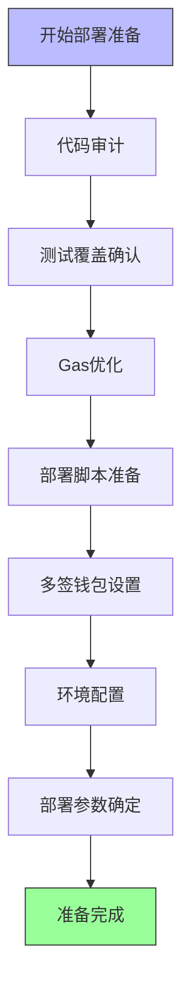
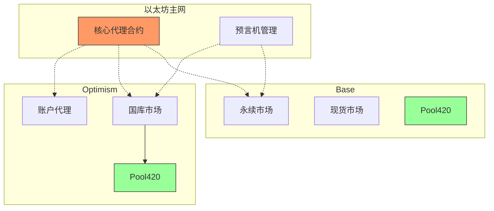
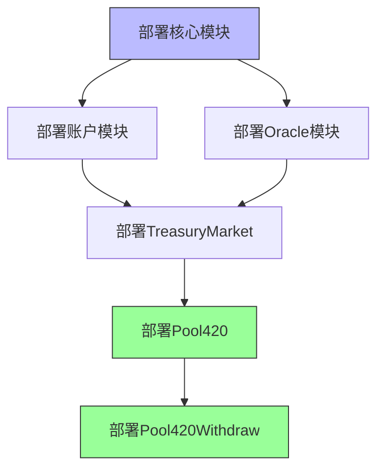
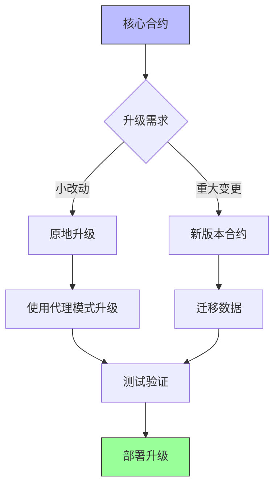
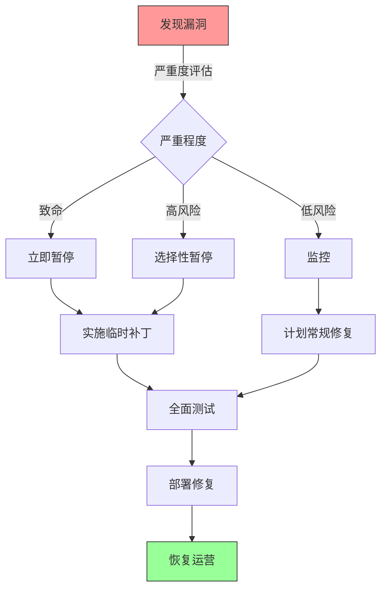

# Synthetix V3 & 420 Pool 部署指南与实践

## 任务使命 (Mission)

掌握Synthetix V3和420 Pool项目的部署流程和最佳实践，确保系统安全、平稳地从开发环境过渡到生产环境，并能够应对后续的升级和维护需求。

## 背景上下文 (Context)

智能合约部署是DeFi项目生命周期中的关键环节，特别是对于Synthetix V3和420 Pool这样的复杂系统，部署过程需要精心规划和执行。一旦合约部署到主网，修改将变得困难且成本高昂，因此正确的部署策略对项目成功至关重要。

## 执行计划 (Plan)

本文档将系统介绍以下部署相关内容：

1. 部署准备工作
2. 网络选择与配置 
3. 合约部署流程
4. 合约验证
5. 部署后配置
6. 升级策略
7. 故障恢复计划
8. 实际部署案例

## 1. 部署准备工作

### 1.1 部署前检查清单

在部署智能合约之前，必须完成以下准备工作：



**详细检查项**：

1. **完成代码审计**：确保代码已经过内部审查和外部审计
2. **测试覆盖率**：确认测试覆盖率达到预期目标（通常>95%）
3. **Gas优化**：确认关键操作的Gas消耗已优化
4. **部署脚本**：准备并测试自动化部署脚本
5. **多签钱包**：设置多签钱包用于合约管理
6. **环境配置**：确保部署环境与测试环境一致
7. **部署参数**：确定初始参数值并记录

### 1.2 部署角色与责任

部署过程中的角色分配：

| 角色 | 责任 | 人员 |
|-----|------|-----|
| 部署执行者 | 执行部署脚本，处理技术问题 | 技术负责人 |
| 参数验证者 | 验证部署参数的正确性 | 产品经理 |
| 多签持有者 | 批准关键操作，管理权限 | 多个团队成员（至少3人） |
| 监控人员 | 监控部署过程和初始运行状态 | 运维工程师 |
| 应急响应者 | 处理部署中的突发问题 | 高级开发者 |

### 1.3 部署环境准备

```bash
# 安装必要工具
npm install --save-dev hardhat @nomiclabs/hardhat-ethers ethers dotenv

# 创建.env文件（注意不要提交到版本控制）
cat > .env << EOL
MAINNET_RPC_URL=https://eth-mainnet.alchemyapi.io/v2/YOUR_KEY
OPTIMISM_RPC_URL=https://opt-mainnet.g.alchemy.com/v2/YOUR_KEY
BASE_RPC_URL=https://mainnet.base.org
PRIVATE_KEY=your_deployer_private_key_here
ETHERSCAN_API_KEY=your_etherscan_api_key_here
EOL

# 配置Hardhat
cat > hardhat.config.js << EOL
require("@nomiclabs/hardhat-ethers");
require("@nomiclabs/hardhat-etherscan");
require('dotenv').config();

module.exports = {
  solidity: {
    version: "0.8.18",
    settings: {
      optimizer: {
        enabled: true,
        runs: 200
      }
    }
  },
  networks: {
    hardhat: {},
    mainnet: {
      url: process.env.MAINNET_RPC_URL,
      accounts: [process.env.PRIVATE_KEY]
    },
    optimism: {
      url: process.env.OPTIMISM_RPC_URL,
      accounts: [process.env.PRIVATE_KEY]
    },
    base: {
      url: process.env.BASE_RPC_URL,
      accounts: [process.env.PRIVATE_KEY]
    }
  },
  etherscan: {
    apiKey: process.env.ETHERSCAN_API_KEY
  }
};
EOL
```

## 2. 网络选择与配置

### 2.1 部署网络选择

Synthetix V3和420 Pool可以部署在多个网络上，每个网络有不同的特点：

| 网络 | 优势 | 劣势 | 适用场景 |
|-----|------|------|---------|
| 以太坊主网 | 最高安全性和流动性 | Gas成本高，交易慢 | 核心合约，如核心代理 |
| Optimism | L2扩展性，低Gas成本 | 安全性依赖以太坊 | 用户交互频繁的合约 |
| Base | 低Gas成本，Coinbase生态 | 相对较新 | 辅助功能，用户界面 |
| Arbitrum | 高吞吐量，低延迟 | - | 需要高性能的场景 |

**Synthetix V3多链部署架构**：



### 2.2 网络特定配置

**Optimism部署的特殊考虑**：

```javascript
// 优化Optimism网络配置
const optimismConfig = {
  gasPrice: 0.001 * 1e9, // 0.001 Gwei
  confirmations: 2, // Optimism通常只需要较少确认数
  timeout: 1200000, // Optimism可能需要更长超时时间
  deploymentGasLimit: 8000000, // Gas限制调整
};

// Optimism跨链消息配置
const crossChainConfig = {
  l1Gateway: "0x25ace71c97B33Cc4729CF772ae268934F7ab5fA1",
  l2Gateway: "0x4200000000000000000000000000000000000007",
  messagingDelay: 1800, // 30分钟确认时间
};
```

**Base部署考虑**：

```javascript
// Base网络配置
const baseConfig = {
  gasPrice: 0.0005 * 1e9, // 0.0005 Gwei
  confirmations: 3,
  deploymentGasLimit: 5000000,
  stableNodeProvider: "https://mainnet.base.org"
};
```

## 3. 合约部署流程

### 3.1 部署顺序与依赖

Synthetix V3和420 Pool的部署需要遵循特定顺序：



**详细部署顺序**：

1. **核心合约**：首先部署不依赖其他合约的核心组件
2. **基础设施**：部署Oracle和账户管理系统
3. **市场合约**：部署各类市场合约，如TreasuryMarket
4. **应用合约**：最后部署420 Pool相关合约

### 3.2 部署脚本示例

使用Hardhat进行自动化部署：

```javascript
// scripts/deploy.js
const { ethers } = require("hardhat");

async function main() {
  console.log("开始部署Synthetix V3和420 Pool合约...");
  
  // 获取部署账户
  const [deployer] = await ethers.getSigners();
  console.log(`使用部署账户: ${deployer.address}`);
  
  // 部署核心合约
  console.log("部署Core合约...");
  const Core = await ethers.getContractFactory("Core");
  const core = await Core.deploy();
  await core.deployed();
  console.log(`Core合约已部署到: ${core.address}`);
  
  // 部署账户模块
  console.log("部署Account模块...");
  const Account = await ethers.getContractFactory("Account");
  const account = await Account.deploy(core.address);
  await account.deployed();
  console.log(`Account合约已部署到: ${account.address}`);
  
  // 部署Oracle模块
  console.log("部署Oracle模块...");
  const Oracle = await ethers.getContractFactory("Oracle");
  const oracle = await Oracle.deploy(core.address);
  await oracle.deployed();
  console.log(`Oracle合约已部署到: ${oracle.address}`);
  
  // 部署TreasuryMarket
  console.log("部署TreasuryMarket...");
  const TreasuryMarket = await ethers.getContractFactory("TreasuryMarket");
  const treasuryMarket = await TreasuryMarket.deploy(
    core.address,
    account.address,
    oracle.address
  );
  await treasuryMarket.deployed();
  console.log(`TreasuryMarket已部署到: ${treasuryMarket.address}`);
  
  // 部署420 Pool
  console.log("部署Pool420...");
  const Pool420 = await ethers.getContractFactory("Pool420");
  const pool420 = await Pool420.deploy(
    core.address,
    account.address,
    treasuryMarket.address,
    "0x...", // SNX代币地址
    365 * 24 * 60 * 60 // jubilee期限（1年）
  );
  await pool420.deployed();
  console.log(`Pool420已部署到: ${pool420.address}`);
  
  // 部署Pool420Withdraw
  console.log("部署Pool420Withdraw...");
  const Pool420Withdraw = await ethers.getContractFactory("Pool420Withdraw");
  const pool420Withdraw = await Pool420Withdraw.deploy(
    pool420.address,
    7 * 24 * 60 * 60 // 冷却期（7天）
  );
  await pool420Withdraw.deployed();
  console.log(`Pool420Withdraw已部署到: ${pool420Withdraw.address}`);
  
  // 设置权限
  console.log("配置合约权限...");
  await pool420.setWithdrawContract(pool420Withdraw.address);
  console.log("Pool420Withdraw地址已设置");
  
  // 将所有权转移给多签钱包
  const multiSigWallet = "0x..."; // 多签钱包地址
  await pool420.transferOwnership(multiSigWallet);
  await pool420Withdraw.transferOwnership(multiSigWallet);
  console.log("所有权已转移给多签钱包");
  
  console.log("部署完成!");
  
  // 输出部署信息摘要
  console.log({
    core: core.address,
    account: account.address,
    oracle: oracle.address,
    treasuryMarket: treasuryMarket.address,
    pool420: pool420.address,
    pool420Withdraw: pool420Withdraw.address
  });
}

main()
  .then(() => process.exit(0))
  .catch((error) => {
    console.error(error);
    process.exit(1);
  });
```

### 3.3 参数配置

部署关键参数及其影响：

| 参数 | 说明 | 典型值 | 影响 |
|-----|------|-------|-----|
| jubileePeriod | 债务减免周期 | 365天 | 影响用户债务减免速度 |
| cooldownPeriod | 提款冷却期 | 7天 | 影响提款流程和系统稳定性 |
| stakingCap | 质押上限 | 10,000,000 SNX | 控制系统风险敞口 |
| issuanceRatio | 发行比率 | 0.2 (20%) | 影响用户获得的初始债务 |
| rewardRate | 奖励发放速率 | 每区块1SNX | 影响质押激励 |

## 4. 合约验证

### 4.1 代码验证流程

部署后验证合约源代码，使其在区块链浏览器上可见：

```bash
# 使用Hardhat验证以太坊主网合约
npx hardhat verify --network mainnet CORE_ADDRESS

# 验证带构造函数参数的合约
npx hardhat verify --network optimism POOL420_ADDRESS \
  CORE_ADDRESS ACCOUNT_ADDRESS TREASURY_MARKET_ADDRESS SNX_TOKEN_ADDRESS JUBILEE_PERIOD

# 验证在Base上的合约
npx hardhat verify --network base POOL420_WITHDRAW_ADDRESS \
  POOL420_ADDRESS COOLDOWN_PERIOD
```

### 4.2 自定义区块链浏览器验证

对于某些网络，可能需要手动验证：

1. 扁平化合约源代码（合并所有依赖）
2. 获取构造函数参数的ABI编码
3. 在区块链浏览器上提交验证

```javascript
// 获取构造函数参数的ABI编码
const encodedParameters = ethers.utils.defaultAbiCoder.encode(
  ['address', 'address', 'address', 'address', 'uint256'],
  [
    coreAddress, 
    accountAddress, 
    treasuryMarketAddress, 
    snxTokenAddress, 
    jubileePeriod
  ]
);

console.log("构造函数参数ABI编码:");
console.log(encodedParameters);
```

## 5. 部署后配置

### 5.1 初始化合约

部署后需要进行的初始化操作：

```javascript
// 初始化Core合约模块
async function initializeCore(core, modules) {
  console.log("初始化Core合约...");
  
  // 设置各模块地址
  await core.setAccountModule(modules.account);
  await core.setOracleModule(modules.oracle);
  await core.setMarketModule(modules.treasuryMarket);
  
  // 配置全局参数
  await core.setGlobalParameter("MIN_CRATIO", ethers.utils.parseEther("1.2")); // 120%最低抵押率
  await core.setGlobalParameter("LIQUIDATION_RATIO", ethers.utils.parseEther("1.1")); // 110%清算率
  
  console.log("Core合约初始化完成");
}

// 初始化TreasuryMarket
async function initializeTreasuryMarket(treasuryMarket, snxAddress) {
  console.log("初始化TreasuryMarket...");
  
  // 创建SNX质押池
  const poolId = ethers.utils.keccak256(ethers.utils.toUtf8Bytes("SNX_STAKING_POOL"));
  await treasuryMarket.createPool(poolId, snxAddress);
  
  // 配置池参数
  await treasuryMarket.configurePool(poolId, 
    ethers.utils.keccak256(ethers.utils.toUtf8Bytes("MIN_CRATIO")), 
    ethers.utils.parseEther("1.5") // 150%最低抵押率
  );
  
  console.log("TreasuryMarket初始化完成");
}

// 初始化Pool420
async function initializePool420(pool420) {
  console.log("初始化Pool420...");
  
  // 设置质押上限
  await pool420.setStakingCap(ethers.utils.parseEther("10000000")); // 1000万SNX
  
  // 设置发行比率
  await pool420.setIssuanceRatio(ethers.utils.parseEther("0.2")); // 20%
  
  console.log("Pool420初始化完成");
}
```

### 5.2 权限配置

安全的权限配置流程：

```javascript
// 配置多签钱包
async function configureMultiSig(contracts, multiSigAddress) {
  console.log("配置多签钱包权限...");
  
  // 转移所有合约的所有权
  for (const [name, contract] of Object.entries(contracts)) {
    if (contract.transferOwnership) {
      await contract.transferOwnership(multiSigAddress);
      console.log(`${name}所有权已转移到多签钱包`);
    }
  }
  
  // 设置特定角色权限
  if (contracts.core.grantRole) {
    // 设置管理员角色
    const ADMIN_ROLE = await contracts.core.ADMIN_ROLE();
    await contracts.core.grantRole(ADMIN_ROLE, multiSigAddress);
    console.log("管理员角色已授予多签钱包");
    
    // 撤销部署者权限
    const deployer = await ethers.getSigner();
    await contracts.core.revokeRole(ADMIN_ROLE, deployer.address);
    console.log("已撤销部署者的管理员权限");
  }
  
  console.log("多签权限配置完成");
}
```

### 5.3 前端配置更新

部署后更新前端配置：

```javascript
// 合约地址配置文件
const contractAddresses = {
  1: { // 以太坊主网
    Core: "0x...",
    Oracle: "0x..."
  },
  10: { // Optimism
    TreasuryMarket: "0x...",
    Pool420: "0x...",
    Pool420Withdraw: "0x..."
  },
  8453: { // Base
    PerpsMarket: "0x...",
    SpotMarket: "0x..."
  }
};

// 导出配置
const fs = require("fs");
fs.writeFileSync(
  "./frontend/src/config/contracts.json", 
  JSON.stringify(contractAddresses, null, 2)
);
console.log("前端配置已更新");
```

## 6. 升级策略

### 6.1 合约升级模式

Synthetix V3采用可升级合约模式：



**升级模式选择**：

1. **代理模式**：核心合约使用代理模式实现原地升级
2. **新版本与迁移**：420 Pool可采用新版本部署和数据迁移
3. **紧急修复**：安全问题可通过紧急暂停和快速升级解决

### 6.2 代理升级示例

使用透明代理模式进行合约升级：

```javascript
// 部署新的实现合约
async function upgradePool420() {
  const Pool420V2 = await ethers.getContractFactory("Pool420V2");
  const pool420V2Implementation = await Pool420V2.deploy();
  await pool420V2Implementation.deployed();
  console.log(`新实现合约已部署到: ${pool420V2Implementation.address}`);
  
  // 获取代理管理合约
  const proxyAdmin = await ethers.getContractAt(
    "ProxyAdmin", 
    PROXY_ADMIN_ADDRESS
  );
  
  // 执行升级
  await proxyAdmin.upgrade(POOL420_PROXY_ADDRESS, pool420V2Implementation.address);
  console.log("代理已升级到新实现");
  
  // 验证升级
  const pool420 = await ethers.getContractAt("Pool420V2", POOL420_PROXY_ADDRESS);
  const version = await pool420.version();
  console.log(`升级后版本: ${version}`);
}
```

### 6.3 数据迁移策略

当需要迁移到全新合约时的数据迁移策略：

```javascript
// 数据迁移示例
async function migrateToNewPool() {
  // 获取旧合约和新合约
  const oldPool = await ethers.getContractAt("Pool420", OLD_POOL_ADDRESS);
  const newPool = await ethers.getContractAt("Pool420V2", NEW_POOL_ADDRESS);
  
  // 获取需要迁移的用户列表
  const stakingEvents = await oldPool.queryFilter(oldPool.filters.Staked());
  const users = [...new Set(stakingEvents.map(event => event.args.user))];
  console.log(`需要迁移${users.length}个用户`);
  
  // 创建迁移合约
  const Migrator = await ethers.getContractFactory("Pool420Migrator");
  const migrator = await Migrator.deploy(oldPool.address, newPool.address);
  await migrator.deployed();
  console.log(`迁移合约已部署到: ${migrator.address}`);
  
  // 给迁移合约授权
  await oldPool.grantRole(MIGRATOR_ROLE, migrator.address);
  await newPool.grantRole(MIGRATOR_ROLE, migrator.address);
  
  // 批量迁移数据
  const batchSize = 50;
  for (let i = 0; i < users.length; i += batchSize) {
    const batch = users.slice(i, i + batchSize);
    await migrator.migrateUsers(batch);
    console.log(`已迁移用户批次 ${i/batchSize+1}/${Math.ceil(users.length/batchSize)}`);
  }
  
  console.log("迁移完成!");
}
```

## 7. 故障恢复计划

### 7.1 紧急暂停机制

在发现严重问题时立即暂停关键功能：

```javascript
// 紧急暂停示例
async function emergencyPause() {
  // 获取合约和权限
  const pool420 = await ethers.getContractAt("Pool420", POOL420_ADDRESS);
  const emergencyTeam = await ethers.getSigner(EMERGENCY_TEAM_ADDRESS);
  
  // 检查是否有暂停权限
  const PAUSER_ROLE = await pool420.PAUSER_ROLE();
  const hasPauserRole = await pool420.hasRole(PAUSER_ROLE, emergencyTeam.address);
  if (!hasPauserRole) {
    console.error("紧急团队没有暂停权限!");
    return;
  }
  
  // 执行暂停
  await pool420.connect(emergencyTeam).pause();
  console.log("合约已暂停");
  
  // 通知利益相关者
  console.log("发送通知...");
  // 实现通知逻辑，如Discord bot, Twitter等
}
```

### 7.2 漏洞响应流程

发现漏洞时的响应流程：



### 7.3 数据备份与恢复

确保关键数据可以恢复：

```javascript
// 链上状态备份
async function backupChainState() {
  const pool420 = await ethers.getContractAt("Pool420", POOL420_ADDRESS);
  
  // 获取所有质押者
  const stakingEvents = await pool420.queryFilter(pool420.filters.Staked());
  const stakers = [...new Set(stakingEvents.map(event => event.args.user))];
  
  // 备份质押数据
  const stakingData = [];
  for (const staker of stakers) {
    const position = await pool420.getPosition(staker);
    stakingData.push({
      user: staker,
      stakedAmount: position.stakedAmount.toString(),
      originalDebt: position.originalDebt.toString(),
      currentDebt: position.currentDebt.toString(),
      entryTimestamp: position.entryTimestamp.toString()
    });
  }
  
  // 保存备份
  const timestamp = Math.floor(Date.now() / 1000);
  fs.writeFileSync(
    `./backups/pool420_state_${timestamp}.json`,
    JSON.stringify(stakingData, null, 2)
  );
  console.log(`已保存${stakingData.length}个用户的质押数据`);
}
```

## 8. 实际部署案例

### 8.1 Optimism上的420 Pool部署案例

以下是在Optimism网络上部署420 Pool的真实案例：

```
部署时间: 2023-03-15 14:30 UTC
网络: Optimism (Chain ID: 10)
部署账户: 0x123...789
Gas价格: 0.001 Gwei
总Gas消耗: 约12,500,000

部署顺序与合约地址:
1. Core Proxy: 0xabc...def
2. Account Module: 0xbcd...ef0
3. Oracle Module: 0xcde...f01
4. TreasuryMarket: 0xdef...012
5. Pool420: 0xef0...123
6. Pool420Withdraw: 0xf01...234

初始参数:
- jubileePeriod: 31536000 (365天)
- cooldownPeriod: 604800 (7天)
- stakingCap: 10,000,000 SNX
- issuanceRatio: 0.2 (20%)

额外配置:
- 多签钱包: 0x234...890 (3/5签名)
- 所有管理员权限已转移给多签钱包
- 前端配置已更新
```

### 8.2 Base上的部署与跨链操作

在Base网络上部署并与其他网络集成的案例：

```
部署时间: 2023-04-10 10:00 UTC
网络: Base (Chain ID: 8453)
部署账户: 0x345...901
Gas价格: 0.0005 Gwei

部署合约:
1. PerpsMarket: 0x123...456
2. SpotMarket: 0x234...567
3. Pool420 (Base版): 0x345...678

跨链配置:
- Optimism跨链消息桥: 0x456...789
- 已设置跨链通信参数，允许用户在Base上执行操作后同步到Optimism
- 跨链消息确认时间: 约30分钟

用户体验优化:
- 实现了跨链状态查询，用户可以在Base上查看Optimism的质押状态
- 前端已更新，支持同时显示多链资产
```

### 8.3 升级案例分析

一个成功的合约升级案例：

```
升级时间: 2023-06-20 09:15 UTC
网络: Optimism
升级原因: 增加新功能并修复小bug

升级内容:
1. 增加批量质押功能
2. 优化Gas使用
3. 修复债务计算中的舍入误差

升级步骤:
1. 部署新实现合约: 0x567...890
2. 进行全面测试，包括回归测试
3. 通过多签提案批准升级
4. 执行代理合约升级
5. 验证新功能正常工作

经验教训:
- 提前一周告知用户即将升级
- 准备详细的回滚计划
- 升级完成后立即监控24小时
- 在测试网进行2次完整演练
```

## 总结

成功部署Synthetix V3和420 Pool需要精心规划、严格测试和细致执行。本文档提供了从准备工作到升级维护的全面指南，旨在确保部署过程安全、高效。

部署不是一次性工作，而是一个持续的过程，涉及监控、升级和维护。采用多签钱包管理、实施紧急响应预案、保持良好的文档记录，是确保DeFi项目长期成功运行的关键。

## 进一步学习

- 研究Hardhat部署插件和自动化工具
- 学习代理合约升级的高级技术
- 探索去中心化治理下的合约升级流程
- 了解跨链部署的最新技术和挑战 