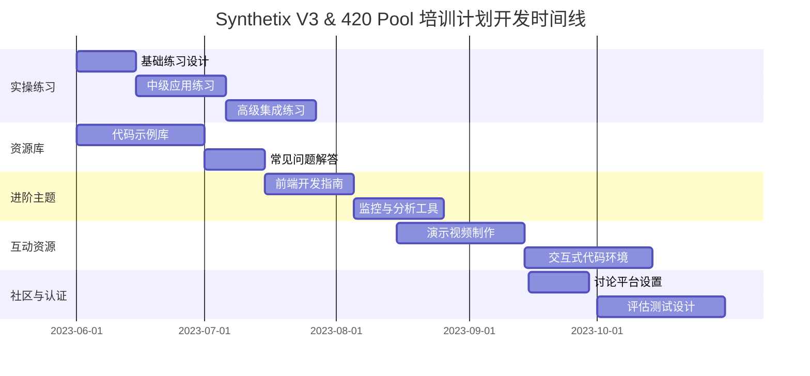

# Synthetix V3 & 420 Pool 培训计划待办事项

## 任务概述

本文档列出了Synthetix V3和420 Pool培训计划的后续开发任务，按优先级和实施阶段进行组织。这些任务旨在进一步丰富培训内容，提升学习体验，并扩展培训系统的实用性。

## 任务进度跟踪

- [ ] 未开始
- [S] 已安排
- [P] 进行中
- [X] 已完成

## 一、实操练习文档（优先级：高）

- [ ] **1.1 基础练习设计**
  - [ ] 环境搭建练习
  - [ ] 合约交互基础练习
  - [ ] 接口调用示例练习

- [ ] **1.2 中级应用练习**
  - [ ] 质押流程完整实现
  - [ ] 提款操作实现
  - [ ] 债务监控工具开发

- [ ] **1.3 高级集成练习**
  - [ ] 多合约协同操作
  - [ ] 跨链操作模拟
  - [ ] 安全漏洞识别与修复

- [ ] **1.4 练习答案与解析**
  - [ ] 标准答案库
  - [ ] 常见错误分析
  - [ ] 实现思路解析

## 二、互动式学习资源（优先级：中）

- [ ] **2.1 演示视频制作**
  - [ ] 合约部署演示视频
  - [ ] 交互流程操作视频
  - [ ] 问题排查指南视频

- [ ] **2.2 交互式代码环境**
  - [ ] 在线代码编辑器配置
  - [ ] 预置模板与示例
  - [ ] 自动化测试脚本

- [ ] **2.3 可视化教学工具**
  - [ ] 交互架构图
  - [ ] 数据流动可视化
  - [ ] 状态变化演示工具

## 三、资源库完善（优先级：高）

- [ ] **3.1 代码示例库**
  - [ ] 基础操作代码片段
  - [ ] 常见场景实现示例
  - [ ] 最佳实践代码模板

- [ ] **3.2 常见问题解答(FAQ)**
  - [ ] 环境配置问题
  - [ ] 合约交互问题
  - [ ] 测试与部署问题

- [ ] **3.3 参考资料整理**
  - [ ] 学术论文与技术博客
  - [ ] 相关项目文档链接
  - [ ] 开发工具参考资料

## 四、进阶主题补充（优先级：中）

- [ ] **4.1 前端开发指南**
  - [ ] React组件设计
  - [ ] 合约监听与事件处理
  - [ ] 用户体验优化

- [ ] **4.2 监控与分析工具**
  - [ ] 链上数据监控方案
  - [ ] 性能分析工具
  - [ ] 用户行为分析方法

- [ ] **4.3 性能优化策略**
  - [ ] Gas优化技术
  - [ ] 批处理操作实现
  - [ ] 存储优化方法

- [ ] **4.4 跨链集成方案**
  - [ ] 多链部署指南
  - [ ] 跨链消息传递
  - [ ] 资产桥接实现

## 五、学习社区建设（优先级：低）

- [ ] **5.1 讨论平台设置**
  - [ ] 开发者论坛搭建
  - [ ] Discord专区设置
  - [ ] GitHub讨论区管理

- [ ] **5.2 定期活动规划**
  - [ ] 线上问答会安排
  - [ ] 代码审查工作坊
  - [ ] 项目展示活动

- [ ] **5.3 贡献者激励机制**
  - [ ] 内容贡献指南
  - [ ] 激励措施设计
  - [ ] 荣誉系统建立

## 六、认证与评估系统（优先级：低）

- [ ] **6.1 评估测试设计**
  - [ ] 基础知识测试
  - [ ] 实操技能评估
  - [ ] 综合案例测试

- [ ] **6.2 认证体系建立**
  - [ ] 认证标准制定
  - [ ] 认证流程设计
  - [ ] 证书生成系统

- [ ] **6.3 进度跟踪系统**
  - [ ] 学习进度记录
  - [ ] 技能掌握图谱
  - [ ] 个性化学习建议

## 实施时间线

## 优先实施项目

基于紧迫性和价值，建议优先实施以下项目：

1. **实操练习 - 基础练习设计**：为初学者提供入门实践机会
2. **资源库 - 代码示例库**：提供即用代码片段，加速学习和开发
3. **进阶主题 - 前端开发指南**：弥补前端与合约交互的知识缺口

## 资源需求

### 人力资源
- 技术文档编写者：2-3人
- 开发示例代码：1-2人
- 视频制作：1人
- 社区管理：1人

### 技术资源
- 开发环境服务器
- 视频制作设备
- 文档托管平台
- 社区管理工具

## 进度记录

| 日期 | 完成项目 | 负责人 | 备注 |
|------|---------|-------|------|
| | | | |

## 定期评审

计划每月进行一次进度评审，检查已完成项目的质量，并根据反馈调整后续任务的优先级和内容。

## 备注

- 所有文档应保持统一风格和格式
- 代码示例应在多个环境中测试通过
- 视频资源应提供文字脚本和字幕
- 定期收集学习者反馈，持续改进内容 